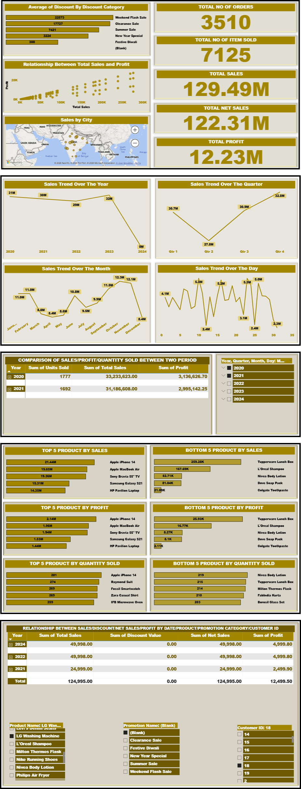

# D.A.C-DATASTORE-Project
This project analyze sales data for D.A.C DATASTORE, an online retail store. The goal of this analysis is to help the management quickly to understand the sales performance, profitability, effect of promotionals and the market trends across the country.

---

## ⁉️Business Questions Answered
- Show the top 5 and bottom 5 products based on sales, profit, or quantity sold.
- Show how sales change over time — daily, monthly, quarterly, and yearly trends.
- Show the relationship between sales and profit.
- Compare sales, profit, and quantity sold between any two time periods the user picks.
- Show the average discount given for each discount category.
- Show the total number of orders.
- Show all order details like sales, profit, discount, net sales, and other fields. Users should be able to filter this by product, date,       customer ID, and promotion categories.
- Show sales broken down by different cities.

---

## 💹Key KPIs
- Total Number of Orders.
- Total Number of Products Sold
- Total Sales
- Net Sales
- Profit Margin

---

## ⚒️Tool Used
- Power Bi
- Dashboard Design Technique
- Slicer
- Chart
- Map
- Card

---

## 📑Dashboard Preview
- 
  
---

## 🔍Key Insight
- Promotional campaigns significantly boosted sales performance.
- There is more sales on gadgets than person care products.
- There is alaways peak sales at 4th quarter of the year.

---

## 📂Files in This Repository
- [Top-Bottom_Analysis](Top-Bottom_Analysis.png)
- [Market Overview 1](Market_Overview_1.png)
- [Market Overview 2](Market_Overview_2.png)
- [Market Overview 3](Market_Overview_3.png)
- [Market Overview 4](Market_Overview_4.png)
- [D.A.C DATASTORE Analysis Dasgboard](D.A.C_DATASTORE_Dasgboard.jpg)
- [D.A.C DATASTORE PROJECT](D.A.C_DATASTORE_PROJECT.pbix)
- [ReadMe](README.md)

---

## ⏳Conclusion
The analysis shows that promotional campaigns were highly effective in driving sales growth across the cities. Gadgets consistently outperformed personal care products, therefore the business should continue leveraging on promotions, prioritize high-performing gadget categories, and strategically prepare for increased demand during the fourth quarter to maximize sales and profitability.

