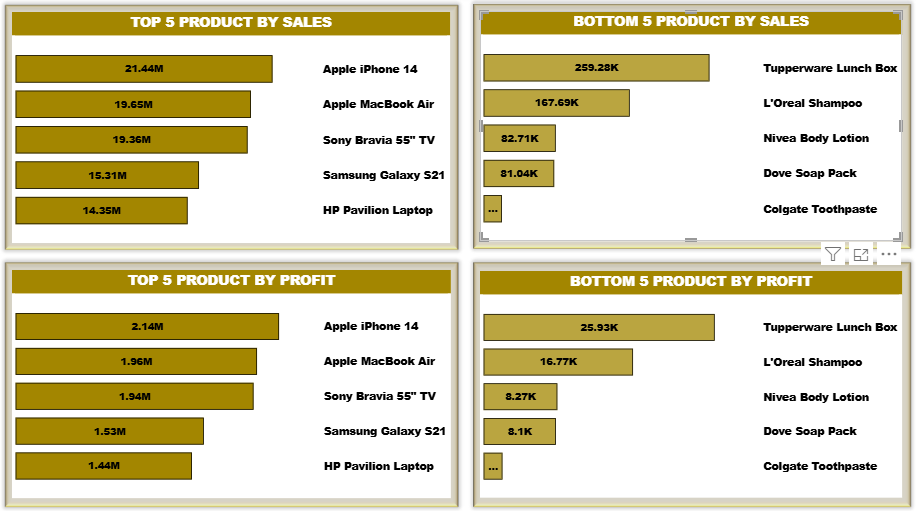

# D.A.C-DATASTORE-Project
This project analyze sales data for D.A.C DATASTORE, an online retail store. The goal of this analysis is to help the management quickly to understand the sales performance, profitability, effect of promotionals and the market trends across the country.

---

## Business Questions Answered
- Show the top 5 and bottom 5 products based on sales, profit, or quantity sold.
  
  
- Show how sales change over time — daily, monthly, quarterly, and yearly trends. 
- Show the relationship between sales and profit. 
- Compare sales, profit, and quantity sold between any two time periods the user picks. 
- Show the average discount given for each discount category. 
- Show the total number of orders. 
- Show all order details like sales, profit, discount, net sales, and other fields. Users should be able to filter this by product, date,       customer ID, and promotion categories. 
- Show sales broken down by different cities.
